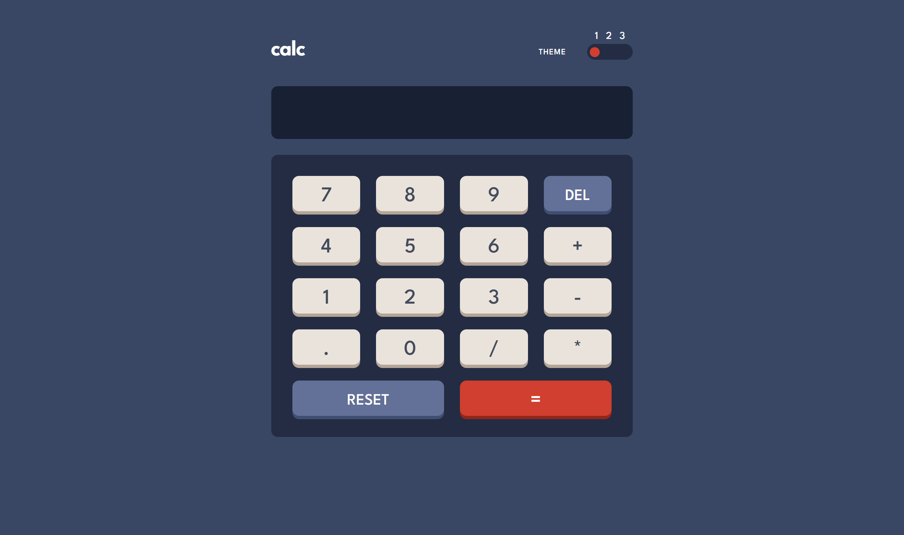

# Frontend Mentor - Calculator app solution

This is a solution to the [Calculator app challenge on Frontend Mentor](https://www.frontendmentor.io/challenges/calculator-app-9lteq5N29). Frontend Mentor challenges help you improve your coding skills by building realistic projects.

## Table of contents

- [Overview](#overview)
  - [The challenge](#the-challenge)
  - [Screenshot](#screenshot)
  - [Links](#links)
- [My process](#my-process)
  - [Built with](#built-with)
  - [What I learned](#what-i-learned)
  - [Continued development](#continued-development)
  - [Useful resources](#useful-resources)
- [Author](#author)
- [Acknowledgments](#acknowledgments)

**Note: Delete this note and update the table of contents based on what sections you keep.**

## Overview

A calculator app for simple math operations. Able to change themes with a toggle.

### The challenge

Users should be able to:

- See the size of the elements adjust based on their device's screen size
- Perform mathmatical operations like addition, subtraction, multiplication, and division
- Adjust the color theme based on their preference
- **Bonus**: Have their initial theme preference checked using `prefers-color-scheme` and have any additional changes saved in the browser

### Screenshot



### Links

- Solution URL: [Add solution URL here](https://your-solution-url.com)
- Live Site URL: [Add live site URL here](https://your-live-site-url.com)

## My process

This project was intimidating at first, but I worked up to it by building tiny programs like the ones shown in the examples.

### Built with

- Flexbox
- CSS Grid
- CSS variables
- Mobile-first CSS
- [React](https://reactjs.org/) - JS library

**Note: These are just examples. Delete this note and replace the list above with your own choices**

### What I learned

Use this section to recap over some of your major learnings while working through this project. Writing these out and providing code samples of areas you want to highlight is a great way to reinforce your own knowledge.

To see how you can add code snippets, see below:

```html
<h1>Some HTML code I'm proud of</h1>
```

```css
.proud-of-this-css {
  color: papayawhip;
}
```

```js
const proudOfThisFunc = () => {
  console.log("🎉");
};
```

If you want more help with writing markdown, we'd recommend checking out [The Markdown Guide](https://www.markdownguide.org/) to learn more.

**Note: Delete this note and the content within this section and replace with your own learnings.**

### Continued development

This program was my first time using the useReducer hook, so I aim to try it in more applications in the future!

I also wanna keep investigating ways to organize my code, App.js got quite long ^^;

### Useful resources

- [React docs]() - This project was intimidating at first since I hadn't done any react work in several months. But I was able to work up to it by building tiny programs like the ones shown in the examples!

- [useReducer article from React Docs](https://beta.reactjs.org/apis/react/useReducer) - I discovered useReducer to be a useful hook.

- [Ben Awad's react hook course](https://www.youtube.com/watch?v=f687hBjwFcM) - I only watched the first 30min but it was a good refresher for the basic hooks I needed here, like useState and useEffect.

## Author

- Frontend Mentor - [@mistyb01](https://www.frontendmentor.io/profile/mistyb01)

## Acknowledgments

I received help with a general approach on the theme slider from Grace Snow on the FE Mentor slack channel!

[Angelos Arnis' slider(http://cssdeck.com/labs/ufct35ys5t)] was a helpful reference for the theme slider as well, which was linked in his answer to a [question on StackExchange(https://ux.stackexchange.com/questions/75399/how-should-a-multi-state-toggle-slider-with-more-than-two-states-be-implemented)]
